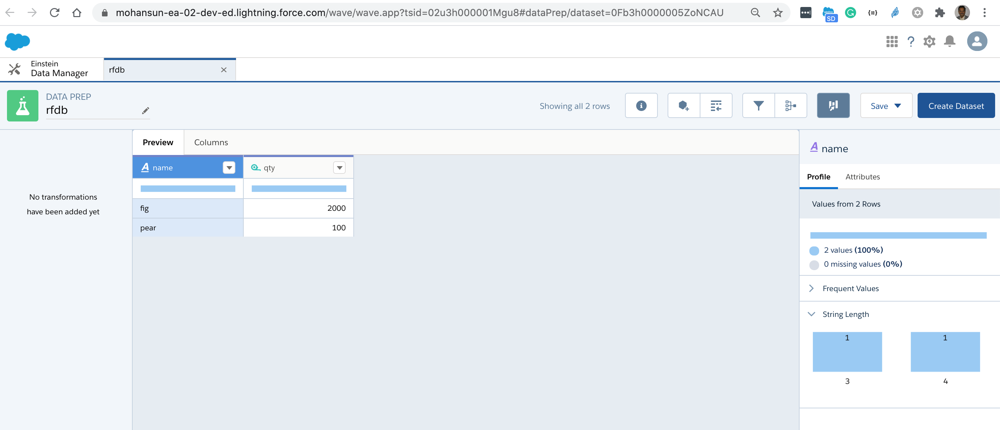
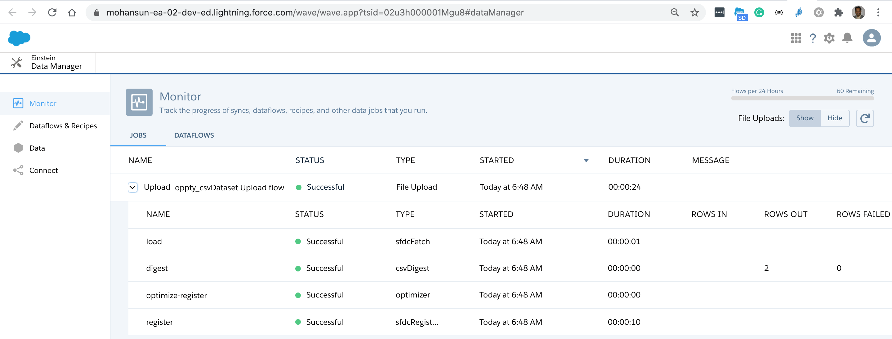
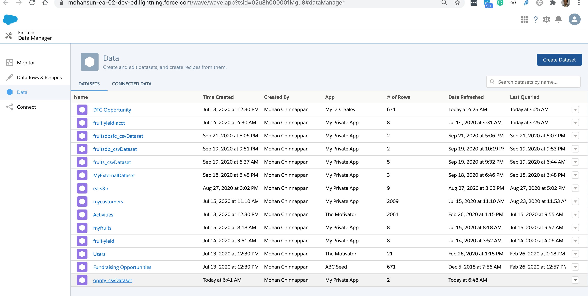
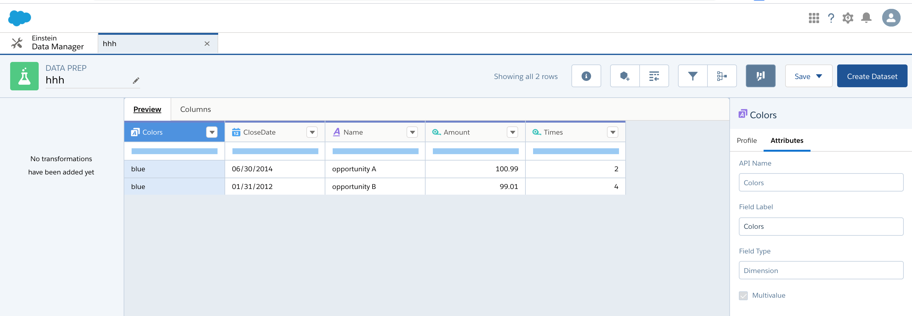

# AWS access via DX

- Requires 0.0.63 version of the plugin
    - sfdx-mohanc-plugins@0.0.63
    - [How to install the plugin](https://mohan-chinnappan-n.github.io/dx/plugins.html#/1)

### Topics
- [List S3 Buckets](#ls)
- [List S3 Bucket Objects](#lsbo)
- [Create S3 Bucket](#mb)
- [Delete S3 Bucket](#rb)
- [Upload a file into S3 Bucket](#upload)
- [Download a file from S3 Bucket](#download)
- [Load the downloaded S3 bucket file into Einstein Analytics (EA) Dataset](#loadea)
- [Load CSV file into Einstein Analytics (EA) Dataset](#loadcsvea)


<a name="ls"></a>
## List S3 buckets

### Usage

- Make sure that you have aws_access_key_id and aws_secret_access_key are in the file  .aws/credentials as shown below 

```
$ cat ~/.aws/credentials 
[default]
aws_access_key_id =  YOUR_KEY_ID_HERE
aws_secret_access_key = YOUR_SECRET_ACCESS_KEY_HERE


## Windows
$ type C:\Users\USER_NAME\.aws\credentials  
[default]
aws_access_key_id =  YOUR_KEY_ID_HERE
aws_secret_access_key = YOUR_SECRET_ACCESS_KEY_HERE


```


```
$ sfdx mohanc:aws:s3:ls  -h
List AWS S3 buckets, bucket objects 

USAGE
  $ sfdx mohanc:aws:s3:ls

OPTIONS
  -b, --bucketname=bucketname                     Bucket Name
  --json                                          format output as json
  --loglevel=(trace|debug|info|warn|error|fatal)  logging level for this command invocation

EXAMPLE

       ** List AWS S3 buckets, bucket object  **

       sfdx mohanc:aws:s3:ls
       sfdx mohanc:aws:s3:ls -b <bucketname>
```

### Demo

```
$ sfdx mohanc:aws:s3:ls 
[
  { Name: 'bucketea1', CreationDate: 2020-08-27T21:12:09.000Z },
  { Name: 'bucketea2', CreationDate: 2020-09-02T15:48:14.000Z }
  }
]

```


<a name="lsbo"></a>
## Listing bucket objects

```
$ sfdx mohanc:aws:s3:ls  -b bucketea1
{
  IsTruncated: false,
  Marker: '',
  Contents: [
    {
      Key: 'ea_folder1/',
      LastModified: 2020-08-27T21:14:00.000Z,
      ETag: '"d41d8cd98f00b204e9800998ecf8427e"',
      Size: 0,
      StorageClass: 'STANDARD',
      Owner: [Object]
    },
    {
      Key: 'ea_folder1/fruits-yield.csv',
      LastModified: 2020-08-27T21:21:35.000Z,
      ETag: '"b87ae1c23b13eaa624384d4daea044bf"',
      Size: 189,
      StorageClass: 'STANDARD',
      Owner: [Object]
    },
    {
      Key: 'ea_folder1/schema_sample.csv',
      LastModified: 2020-08-27T21:57:55.000Z,
      ETag: '"6fda0df91493bff61859d2ca0d19c962"',
      Size: 35,
      StorageClass: 'STANDARD',
      Owner: [Object]
    }
  ],
  Name: 'bucketea1',
  Prefix: '',
  MaxKeys: 1000,
  CommonPrefixes: []
}

```
<a name="mb"></a>
## Create a bucket

### Usage
```
$ sfdx mohanc:aws:s3:mb -h
Create AWS S3 bucket 

USAGE
  $ sfdx mohanc:aws:s3:mb

OPTIONS
  -b, --bucketname=bucketname                     Bucket Name to create

  -p, --perm=perm                                 ACL - permission (optional) private (default) | public-read | public-read-write | 
                                                  authenticated-read

  --json                                          format output as json

  --loglevel=(trace|debug|info|warn|error|fatal)  logging level for this command invocation

EXAMPLE

       ** Create AWS S3 bucket  **

       sfdx mohanc:aws:s3:mb -b <bucketname> -p [perm]

       if bucketname is empty it will create a bucket in the format:
       mybuk-<UUID>
```

### Demo
```
$ sfdx mohanc:aws:s3:mb -b fruits
bucketname: fruits-790f15af-0986-48f3-8c61-fb5f84a9f9eb
{ Location: '/fruits-790f15af-0986-48f3-8c61-fb5f84a9f9eb' }
~/sfdx/sfdx-mohanc-plugins:
$ sfdx mohanc:aws:s3:ls
[
  { Name: 'bucketea1', CreationDate: 2020-08-27T21:12:09.000Z },
  { Name: 'bucketea2', CreationDate: 2020-09-02T15:48:14.000Z },
  {
    Name: 'fruits-790f15af-0986-48f3-8c61-fb5f84a9f9eb',
    CreationDate: 2020-09-05T12:54:54.000Z
  }
]

```

<a name='rb'></a>

## Delete a S3 Bucket
### Usage
```
$ sfdx mohanc:aws:s3:rb -h
Delete AWS S3 bucket 

USAGE
  $ sfdx mohanc:aws:s3:rb

OPTIONS
  -b, --bucketname=bucketname                     Bucket Name to delete
  --json                                          format output as json
  --loglevel=(trace|debug|info|warn|error|fatal)  logging level for this command invocation

EXAMPLE

       ** Delete AWS S3 bucket  **

       sfdx mohanc:aws:s3:rb -b <bucketname>

```

### Demo
```
## List 
$ sfdx mohanc:aws:s3:ls
[
  { Name: 'bucketea1', CreationDate: 2020-08-27T21:12:09.000Z },
  { Name: 'bucketea2', CreationDate: 2020-09-02T15:48:14.000Z },
  {
    Name: 'fruits-790f15af-0986-48f3-8c61-fb5f84a9f9eb',
    CreationDate: 2020-09-05T12:54:54.000Z
  },
  {
    Name: 'veggie-4245ddc6-e5b9-4971-9533-9e98c8d2d96e',
    CreationDate: 2020-09-05T13:03:44.000Z
  }
]

## Delete
$ sfdx mohanc:aws:s3:rb -b veggie-4245ddc6-e5b9-4971-9533-9e98c8d2d96e
delete bucketname: veggie-4245ddc6-e5b9-4971-9533-9e98c8d2d96e
{}

## List again
$ sfdx mohanc:aws:s3:ls
[
  { Name: 'bucketea1', CreationDate: 2020-08-27T21:12:09.000Z },
  { Name: 'bucketea2', CreationDate: 2020-09-02T15:48:14.000Z },
  {
    Name: 'fruits-790f15af-0986-48f3-8c61-fb5f84a9f9eb',
    CreationDate: 2020-09-05T12:54:54.000Z
  }
]
```

<a name='upload'></a>
## Upload a file into S3 Bucket

### Usage
```
$ sfdx mohanc:aws:s3:upload -h
Upload a file into a AWS S3 bucket 

USAGE
  $ sfdx mohanc:aws:s3:upload

OPTIONS
  -b, --bucketname=bucketname                     Bucket Name
  -f, --foldername=foldername                     Folder Name (optional)
  -i, --inputfilename=inputfilename               Input filename to upload

  -p, --perm=perm                                 ACL - permission (optional) private (default) | public-read | public-read-write | 
                                                  authenticated-read | aws-exec-read | bucket-owner-read | bucket-owner-full-control

  --json                                          format output as json

  --loglevel=(trace|debug|info|warn|error|fatal)  logging level for this command invocation

EXAMPLE

       ** Upload a file into a AWS S3 bucket  **

       sfdx mohanc:aws:s3:upload -b <bucketname> -f [folderName] -i <inputFileName> -p [perm]

     
```

### Demo

```
## List the buckets
$ sfdx mohanc:aws:s3:ls
[
  { Name: 'bucketea1', CreationDate: 2020-08-27T21:12:09.000Z },
  { Name: 'bucketea2', CreationDate: 2020-09-02T15:48:14.000Z },
  {
    Name: 'fruits-790f15af-0986-48f3-8c61-fb5f84a9f9eb',
    CreationDate: 2020-09-05T12:54:54.000Z
  }
]

## Upload into the bucket: fruits-790f15af-0986-48f3-8c61-fb5f84a9f9eb and the folder mydata
$ sfdx mohanc:aws:s3:upload -b fruits-790f15af-0986-48f3-8c61-fb5f84a9f9eb -f mydata -i data/fruits-2.csv -p private
Upload Success: https://fruits-790f15af-0986-48f3-8c61-fb5f84a9f9eb.s3.amazonaws.com/mydata/fruits-2.csv

$ sfdx mohanc:aws:s3:ls -b fruits-790f15af-0986-48f3-8c61-fb5f84a9f9eb
{
  IsTruncated: false,
  Marker: '',
  Contents: [
    {
      Key: 'fruits.csv',
      LastModified: 2020-09-06T00:02:25.000Z,
      ETag: '"4afa7be447a3a57456fdd1a04b9b823a"',
      Size: 53,
      StorageClass: 'STANDARD',
      Owner: [Object]
    },
    {
      Key: 'mydata/fruits-2.csv',
      LastModified: 2020-09-06T00:53:06.000Z,
      ETag: '"2f60af499f0304f33486a267bfc48fa0"',
      Size: 27,
      StorageClass: 'STANDARD',
      Owner: [Object]
    }
  ],
  Name: 'fruits-790f15af-0986-48f3-8c61-fb5f84a9f9eb',
  Prefix: '',
  MaxKeys: 1000,
  CommonPrefixes: []
}
```


<a name='download'></a>
## Download a file from the S3 Bucket

### Usage
```

$ sfdx mohanc:aws:s3:download -h

Download a file from the AWS S3 bucket 

USAGE
  $ sfdx mohanc:aws:s3:download

OPTIONS
  -b, --bucketname=bucketname                     Bucket Name
  -f, --filename=filename                         Filename to download
  -o, --outputfilename=outputfilename             Local filename to download into
  --json                                          format output as json
  --loglevel=(trace|debug|info|warn|error|fatal)  logging level for this command invocation

EXAMPLE

       ** Download a file from the AWS S3 bucket  **

       sfdx mohanc:aws:s3:download -b <bucketname>  -f <inputFileName> -o <localFileName>


```
### Demo
```
## List the buckets
$ sfdx mohanc:aws:s3:ls
[
  { Name: 'bucketea1', CreationDate: 2020-08-27T21:12:09.000Z },
  { Name: 'bucketea2', CreationDate: 2020-09-02T15:48:14.000Z },
  {
    Name: 'fruits-790f15af-0986-48f3-8c61-fb5f84a9f9eb',
    CreationDate: 2020-09-05T12:54:54.000Z
  },
  {
    Name: 'trees-e40790c1-a951-4814-9fb1-2c46446081f4',
    CreationDate: 2020-09-06T01:01:08.000Z
  }
]

## List the objects in the bucket
$ sfdx mohanc:aws:s3:ls -b fruits-790f15af-0986-48f3-8c61-fb5f84a9f9eb
{
  IsTruncated: false,
  Marker: '',
  Contents: [
    {
      Key: 'fruits.csv',
      LastModified: 2020-09-06T00:02:25.000Z,
      ETag: '"4afa7be447a3a57456fdd1a04b9b823a"',
      Size: 53,
      StorageClass: 'STANDARD',
      Owner: [Object]
    },
    {
      Key: 'mydata/fruits-2.csv',
      LastModified: 2020-09-06T00:53:06.000Z,
      ETag: '"2f60af499f0304f33486a267bfc48fa0"',
      Size: 27,
      StorageClass: 'STANDARD',
      Owner: [Object]
    }
  ],
  Name: 'fruits-790f15af-0986-48f3-8c61-fb5f84a9f9eb',
  Prefix: '',
  MaxKeys: 1000,
  CommonPrefixes: []
}

## Download
$ sfdx mohanc:aws:s3:download -b fruits-790f15af-0986-48f3-8c61-fb5f84a9f9eb -f mydata/fruits-2.csv -o /tmp/fruitsdb.csv
Done.

## View the downladed file
$ cat /tmp/fruitsdb.csv 
name,qty
fig,2000
pear,100

```

<a name="loadea"></a>
# Load the downloaded bucket file into Einstein Analytics (EA) Dataset

## Usage
```
Dataset Loader for EA  

USAGE
  $ sfdx mohanc:ea:dataset:load

OPTIONS
  -d, --datafile=datafile                         Data file in csv format to load
  -m, --mulvalfields=mulvalfields                 Multi Value Field Names in CSV
  -o, --operation=operation                       Operation to perform : Overwrite|Append|Upsert|Delete
  -s, --mulvalsep=mulvalsep                       multiValue separator: default ','
  -u, --targetusername=targetusername             username or alias for the target org; overrides default target org
  --apiversion=apiversion                         override the api version used for api requests made by this command
  --json                                          format output as json
  --loglevel=(trace|debug|info|warn|error|fatal)  logging level for this command invocation

EXAMPLE

              Loads the given csv file in EA as a dataset

              sfdx mohanc:ea:dataset:load  -u <username> -d <datafile.csv> -o Upsert -m <multiValueFields as CSV> -s <multiValue separator: default ','>


``` 

### Demo

- NOTE: Data field should be in the format MM/dd/yyyy
    - Example: 01/31/2012 (note the month has to be zero-padded month (01) as shown in this example)

- Let us load into EA

```
- Input data
$ cat ~/.ea/oppty.csv 
Name,Amount,Times,CloseDate,Colors
"opportunity A",100.99,2,06/30/2014,"red|blue"
"opportunity B",99.01,4,01/31/2012,"yellow|blue"

```

```
$ sfdx mohanc:ea:dataset:load -u mohan.chinnappan.n_ea2@gmail.com -d ~/.ea/oppty.csv  -m 'Colors' -s '|'
```
```
[
  {
    fullyQualifiedName: 'oppty_csvDataset.Name',
    label: 'Name',
    name: 'Name',
    isSystemField: false,
    isUniqueId: false,
    isMultiValue: false,
    multiValueSeparator: 'null',
    type: 'Text'
  },
  {
    fullyQualifiedName: 'oppty_csvDataset.Amount',
    label: 'Amount',
    name: 'Amount',
    isSystemField: false,
    isUniqueId: false,
    type: 'Numeric',
    defaultValue: '0',
    precision: 18,
    scale: 2
  },
  {
    fullyQualifiedName: 'oppty_csvDataset.Times',
    label: 'Times',
    name: 'Times',
    isSystemField: false,
    isUniqueId: false,
    type: 'Numeric',
    defaultValue: '0',
    precision: 18,
    scale: 0
  },
  {
    fullyQualifiedName: 'oppty_csvDataset.CloseDate',
    label: 'CloseDate',
    name: 'CloseDate',
    isSystemField: false,
    isUniqueId: false,
    type: 'Date',
    format: 'MM/dd/yyyy',
    fiscalMonthOffset: 0
  },
  {
    fullyQualifiedName: 'oppty_csvDataset.Colors',
    label: 'Colors',
    name: 'Colors',
    isSystemField: false,
    isUniqueId: false,
    isMultiValue: true,
    multiValueSeparator: '|',
    type: 'Text'
  }
]
{ id: '06V3h0000005ooyEAA', success: true, errors: [] }
Load part: 1
{ id: '06W3h00000070MWEAY', success: true, errors: [] }
Going to process...

Done.

```   
- Job created


- Dataset created


- Recipe 


<a name='loadcsvea'></a>

# Load a CSV  file into Einstein Analytics (EA) Dataset

## Usage
```
$ sfdx mohanc:ea:dataset:load -h

Dataset Loader for EA  

USAGE
  $ sfdx mohanc:ea:dataset:load

OPTIONS
  -d, --datafile=datafile                         Data file in csv format to load
  -o, --operation=operation                       Operation to perform : Overwrite|Append|Upsert|Delete
  -u, --targetusername=targetusername             username or alias for the target org; overrides default target org
  --apiversion=apiversion                         override the api version used for api requests made by this command
  --json                                          format output as json
  --loglevel=(trace|debug|info|warn|error|fatal)  logging level for this command invocation

EXAMPLE

              Loads the given csv file in EA as a dataset

              sfdx mohanc:ea:dataset:load  -u <username> -d <datafile.csv> -o Upsert

``` 

### Demo

- Input data
```
$ cat ~/.ea/oppty.csv
```
```csv
Name,Amount,CloseDate
opportunityA,100.99,06/30/2014
opportunityB,99.01,01/31/2012
```
- **NOTE**: Data field should be in the format **MM/dd/yyyy**
    - Example: *01/31/2012* (note the month has to be zero-padded month (*01*) as shown in this example)
- Let us load into EA

```
$  sfdx mohanc:ea:dataset:load -u mohan.chinnappan.n_ea2@gmail.com -d ~/.ea/oppty.csv 
```
```
[
  {
    fullyQualifiedName: 'oppty_csvDataset.Name',
    label: 'Name',
    name: 'Name',
    isSystemField: false,
    isUniqueId: false,
    isMultiValue: false,
    type: 'Text'
  },
  {
    fullyQualifiedName: 'oppty_csvDataset.Amount',
    label: 'Amount',
    name: 'Amount',
    isSystemField: false,
    isUniqueId: false,
    type: 'Numeric',
    defaultValue: '0',
    precision: 18,
    scale: 2
  },
  {
    fullyQualifiedName: 'oppty_csvDataset.CloseDate',
    label: 'CloseDate',
    name: 'CloseDate',
    isSystemField: false,
    isUniqueId: false,
    type: 'Date',
    format: 'MM/dd/yyyy',
    fiscalMonthOffset: 0
  }
]
```
```
{ id: '06V3h0000005l9TEAQ', success: true, errors: [] }
Load part: 1
{ id: '06W3h0000006wdnEAA', success: true, errors: [] }
Going to process...

Done.

```   
- Job created


- Dataset created


- Recipe 



